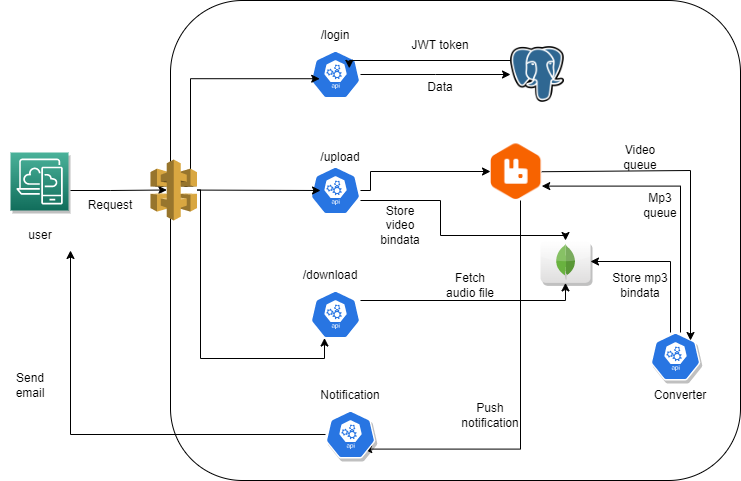
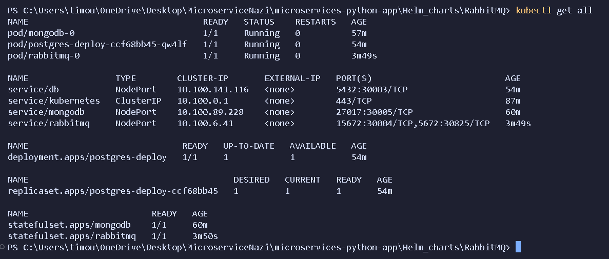
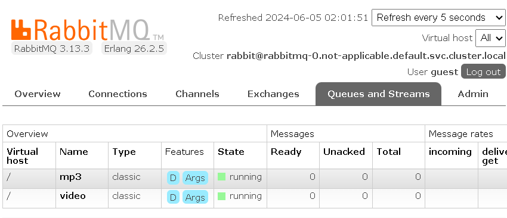
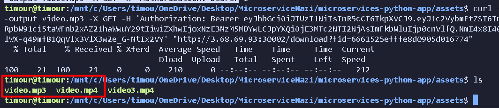

# Devops Project: video-converter
Converting mp4 videos to mp3 in a microservices architecture.

## Architecture Diagramm

## Used elements

- AWS EKS
- Helm
- PostgreSQL
- MongoDB
- RabbitMQ
- Docker
- Python

## Api tests

## Picture summary

